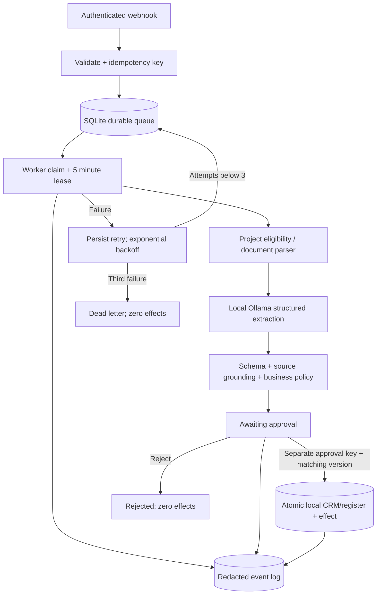

# CRM Missed-Lead Recovery

**SELF-BUILT TECHNICAL PROOF — NOT A CLIENT CASE STUDY**

Built for JIMMYZHU with Codex assistance. This demonstrates inspectable code and recorded local execution. It does not claim client history, unaided coding experience, production deployment, certifications or revenue.

Synthetic CRM record -> consent / SLA / handled checks -> purchase intent -> draft task -> review -> version-checked CRM task.

## What actually runs

A real FastAPI webhook, a durable Python/SQLite workflow, local Ollama inference, structured JSON validation, bounded retries and an authenticated approval gate. The final sink is **local synthetic SQLite**, not a claimed HubSpot/Salesforce/email vendor integration. No outbound email, customer action or payment is sent. This is an executable equivalent workflow, not an untested n8n export. The three portfolio repositories deliberately share the same small workflow engine, with different processors and tests.

## Run and inspect

Requires Python 3.11+ and, for live inference, [Ollama](https://ollama.com) with `qwen2.5-coder:7b-instruct-q4_K_M`. The recorded run used an already installed local model. A first-time download is about 4.7 GB; adequate local memory is needed. No cloud API subscription or credits are required; local hardware/electricity costs are not claimed to be zero.

```sh
python -m venv .venv
# Activate .venv (Windows: .venv\Scripts\activate; macOS/Linux: source .venv/bin/activate)
python -m pip install -r requirements.txt
python -m pytest -q
ollama pull qwen2.5-coder:7b-instruct-q4_K_M
python scripts/demo.py
```

`demo.py` starts a real loopback HTTP server, submits the synthetic fixture, calls the local model, verifies zero effects before approval, tests denied approval with the worker key, simulates an authorized reviewer action, confirms one local effect, and rejects replayed approval. It then stops its server. It creates `evidence/live-run.json` and `evidence/live-run.html`. **The demo reviewer action is automated, not a real buyer or human approval.**

For an interactive run with a real person reviewing:

```sh
python scripts/start_local.py
# In another terminal, from this repository:
python scripts/submit_fixture.py
```

Open `http://127.0.0.1:8010/docs`. Role keys are generated in ignored `var/local-keys.json`. Use the OPERATOR key to GET the job and inspect its output. Use the distinct APPROVAL key to POST `/jobs/{job_id}/decision` with the current `version`, a reviewer label and `approve: true` or `false`. A worker cannot approve. The reviewer label is an audit label, not verified identity. The API binds only to localhost. Stop with Ctrl+C. An interrupted model call can leave a processing lease; the worker safely reclaims it after five minutes. Run one repository at a time on port 8010.

## API contract

| Endpoint | Required role | Behavior |
|---|---|---|
| POST /webhooks/intake | WEBHOOK; Idempotency-Key header | Validate and enqueue; repeat body/key returns same job; changed body/key conflicts |
| GET /jobs/{id} | OPERATOR | Input, state, structured result, record version |
| POST /jobs/{id}/run | OPERATOR | Process one due job; separate worker normally does this |
| GET /jobs/{id}/events | OPERATOR | Redacted ordered operational log |
| POST /jobs/{id}/decision | APPROVAL | Atomic approval/rejection; stale and duplicate approvals fail |
| GET /records/{key} | OPERATOR | Inspect local synthetic output |
| POST /records/{key}/human-contact | APPROVAL | Mark human handling and increment record version |

Input fixture: `automation/fixtures.py`. OpenAPI JSON: `/openapi.json`. Payload size is capped at 512 KB. No credentials are logged in evidence.

## Architecture



## Failure behavior and guarantees

- Worker claims are serialized; inference runs outside the SQLite transaction. A 300-second lease permits recovery after a worker crash. A stale worker cannot overwrite a newer claim.
- Retry timing and attempt count are persisted (2 and 4 second delays before retries; at most three processing attempts). The third failure goes to `dead_letter`; it is never approved or applied automatically. Validation and permanent failures also terminate after the bounded budget; no infinite retry loop.
- Model output is schema validated, source grounded, then constrained by code. The model cannot select arbitrary network destinations, execute tools or bypass approval. Model failure does not silently fall back to fake AI output.
- Only approval commits a local effect, record and audit event in one transaction. This provides exactly-once local effects, **not** exactly-once guarantees for unimplemented external services.
- SQLite optimistic versions reject conflicting record updates and stale review decisions. Recovery also checks whether a lead has already been handled or opted out.
- Rejection leaves existing records unchanged. There is no external rollback claim. Keep the input record/version and export evidence before resetting a disposable local database.

## Evidence and test boundaries

- `evidence/live-run.json`: actual local-model provenance, source hashes, HTTP transcript, structured output and event log.
- `evidence/live-run.html` and `evidence/demo.png`: readable report and screenshot generated from that actual run.
- `evidence/unit-tests.xml`: local automated test results.
- Tests use an explicitly named `TEST_DOUBLE_NOT_AI` for deterministic failure injection. They cover retries, dead letters, restart, concurrency, idempotency, approval separation and domain edge cases. Those tests are separate from the live local-model run.
- CI (when published) runs the deterministic tests on a standard public GitHub runner; it does not claim live AI inference. No artifacts or cache storage are uploaded by CI.

## Limitations

This is a technical portfolio, not a production-ready multi-tenant service. No external CRM/email account is connected. Local credentials replace SSO/RBAC, and there is no Internet-facing rate limiting, production monitoring, retention policy, load testing or security audit. SQL data and payloads are unencrypted on the local disk. Use only the provided synthetic data. Prompt grounding does not prove all model interpretations correct; human review remains required. Do not expose localhost services to the Internet without engineering those controls.

The intake project supports small text PDFs and plain MIME email only; scanned PDFs need OCR/manual review and fail closed. It does not infer missing amounts/dates or initiate payment. The recovery project creates an internal task/draft, not an automatic follow-up email.

## References

[Ollama structured outputs](https://docs.ollama.com/capabilities/structured-outputs), [FastAPI tests](https://fastapi.tiangolo.com/tutorial/testing/), [pypdf extraction](https://pypdf.readthedocs.io/en/stable/user/extract-text.html).
